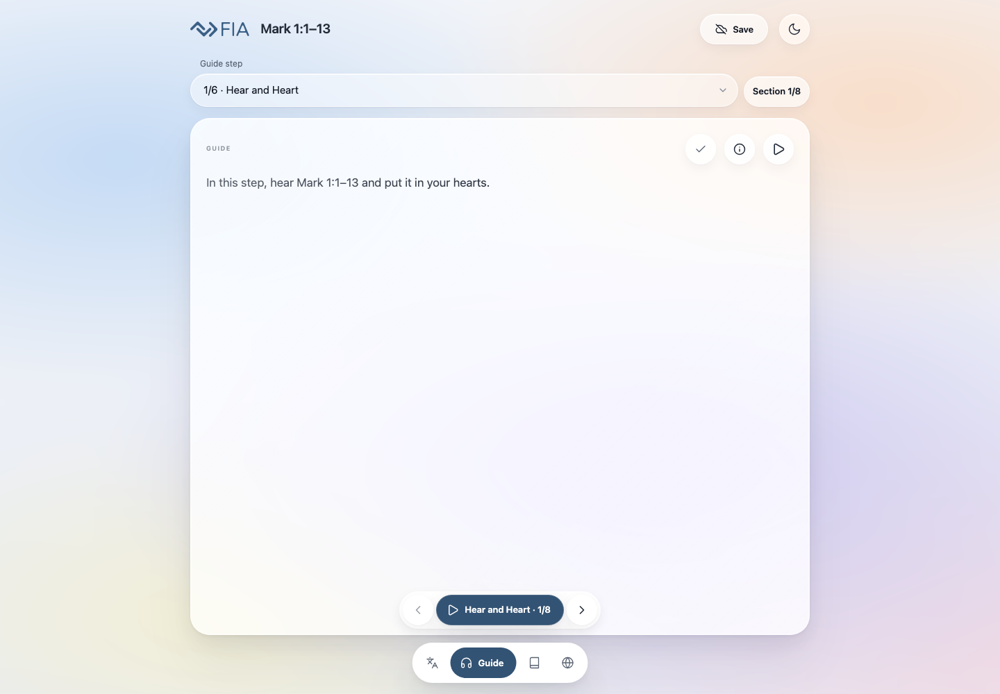
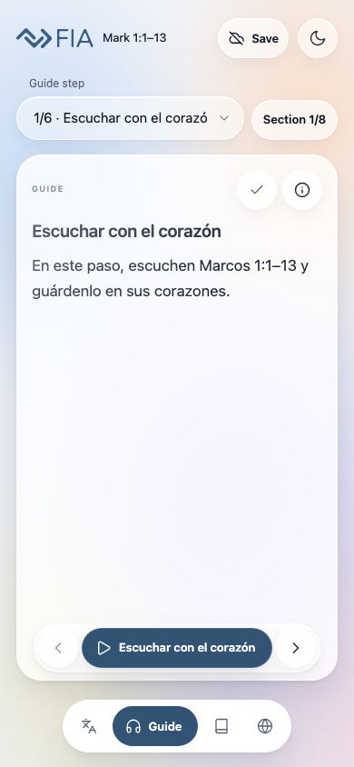

# Screenshot map and case coverage

All images are post-meeting current-live captures. IDs point to the40-item delivery checklist in the adjacent harvest evidence. A mapped image shows relevant UI; it does not certify acceptance. See BASELINE.md for cache, language, narration and historical limits.

## Capture index

| Image | UTC capture time | Checklist IDs | State / qualification | SHA256 |
|---|---|---|---|---|
| [01-initial-light](screenshots/01-initial-light.png) | 2026-09-15T21:30:36.582Z | #3, #4, #5, #6, #20, #25 | Fresh isolated browser context, default English, default narration; no offline pack saved. | `0b3c30a1c3509d69ac744b58aaab3026efcf8486c080605a689c6c58e825ba29` |
| [02-initial-dark](screenshots/02-initial-dark.png) | 2026-09-15T21:30:36.718Z | #4, #26 | Same initial guide, dark theme selected through UI. | `c210b455dc4e616d168e8626b5e6af6e1bc1369e14545195100597ff5ce459d6` |
| [03-next-guide-light](screenshots/03-next-guide-light.png) | 2026-09-15T21:30:37.117Z | #3, #4, #6, #21, #25 | Advanced once using secondary next; guide position visible. | `ed3c12835f9406dc11698c1918fe23d0875fb6f804c4f1d4430f133d2cd3cea6` |
| [04-section-browser](screenshots/04-section-browser.png) | 2026-09-15T21:30:37.225Z | #6, #20, #24, #27 | Section browser opened from guide. | `b3b90cb51548c316a0da1e5f7728d26d4ee099e61f0676cc6893e38610f0827b` |
| [05-dramatization-start](screenshots/05-dramatization-start.png) | 2026-09-15T21:30:37.350Z | #3, #6, #27 | Stage four selected; initial chunk. | `47ad4a72c9d6ff506027ea12494b5f4689c0e1d473abeb417b1091676af8e3d4` |
| [06-dramatization-next](screenshots/06-dramatization-next.png) | 2026-09-15T21:30:37.497Z | #27 | Stage four next chunk. | `8e642cd11aba5aae26948076a7fbf30a9dafa0f7a6d38010964c498a2898b433` |
| [07-complete-guide](screenshots/07-complete-guide.png) | 2026-09-15T21:30:37.705Z | #16, #24, #27 | Complete guide and attribution opened. | `61d318d592629f5e70e350f557578df9785e899a6e302c5547154fd3517e7320` |
| [08-resources](screenshots/08-resources.png) | 2026-09-15T21:30:37.887Z | #5, #9, #11, #12, #15 | Resources initial viewport with image/video affordances. | `2d903c2e6b12bae0a3517e87daa91d8a0b14968e94dcc2226028fee79bcbcbf3` |
| [09-image-open](screenshots/09-image-open.png) | 2026-09-15T21:30:38.122Z | #9, #11 | Image view opened via image action. | `df569691fc8ca9d525645d4381a040ed65d0dca6e1a7a0f4cebae0c391ee8eaa` |
| [10-long-resource](screenshots/10-long-resource.png) | 2026-09-15T21:30:38.310Z | #12, #13, #15 | Prophet term opened; audio controls before play. | `bb5393657bc3fc48a2c210cb52d54b45b0a2a133d763e4b03c3fda6237a5e099` |
| [11-scripture](screenshots/11-scripture.png) | 2026-09-15T21:30:38.566Z | #14, #30 | Scripture view before playback. | `9304cf1db189b40eda20ba16a79d73f104339ea1a9881e876f8db93ed888d705` |
| [12-offline-settings](screenshots/12-offline-settings.png) | 2026-09-15T21:30:38.678Z | #17, #18, #19 | Save/settings opened, before any pack download. | `e6a3631ca9c6061194d58a17a472051fcdec26bcef223b9eb3834d183b779799` |
| [13-languages](screenshots/13-languages.png) | 2026-09-15T21:30:38.810Z | #8, #29 | Language chooser. | `c11147e7956f43a0c15811a215edfdadfc3a6714a7ec7f2348ea27b78d7ab383` |
| [14-large-root-font-simulation](screenshots/14-large-root-font-simulation.png) | 2026-09-15T21:30:38.930Z | #22, #23 | Diagnostic local 200% root-font override, NOT actual operating-system text accessibility setting; underlying served bytes unchanged. | `52b46c4287137bc361df01fb91c2d786eb8131c1e4b21c6440b78fe3a6b8d8ec` |
| [15-offline-unsaved](screenshots/15-offline-unsaved.png) | 2026-09-15T21:30:39.007Z | #18, #36 | FAILED NAVIGATION: unsaved browser context switched offline and reload failed; blank browser error page, not an app screenshot or evidence of broken saved-offline capability. | `fb32313e11bc8ffbd5310a1660e630b64cedb4622f8462a5eae2d5464ac8279e` |
| [16-double-computed-font-diagnostic](screenshots/16-double-computed-font-diagnostic.png) | 2026-09-15T21:31:20.154Z | #22, #23 | Local diagnostic doubles each existing element computed font size, not an operating-system setting or unmodified app view. Exposes text inflation response; no production change. | `5c596ec57a119de292a0bd9dd030adc45b9c6c7fa56757be7ec6e67ba4ad3154` |
| [17-map-modal](screenshots/17-map-modal.png) | 2026-09-15T21:31:21.264Z | #9, #10, #11 | TRANSITIONAL map modal while image loading; not evidence of failed map rendering. Loaded-map follow-up did not meet image-complete condition within10seconds; no defect cause inferred. | `e1d2f8bda7a9ab627596ffe8e6315c23338304245090fe08f091fcda81c5f43d` |
| [18-map-full-original-tab](screenshots/18-map-full-original-tab.png) | 2026-09-15T21:31:22.098Z | #11 | Full-size original opens separate tab; screenshot captures browser-rendered image. Physical pinch/return not tested. | `8d3b7fb7246ab9089eb363c7fb1421aa8b54f3226ca701df6f27e9c2b9595dc8` |
| [19-long-resource-playing](screenshots/19-long-resource-playing.png) | 2026-09-15T21:31:53.875Z | #12, #13, #15 | Prophet resource after play activation; visual player state only, no independent listening/seek success claim. | `715aa77e2d0ff402aca0da833a866edbb01d4ace80f3dfbb18aca18f87ab39b5` |
| [20-scripture-playing](screenshots/20-scripture-playing.png) | 2026-09-15T21:33:07.871Z | #14, #26 | BSB playback activated; visual state, no independent auditory/alignment validation. | `b624a44d9aeda785c2083fa625fba30c54fa950d80f267c628f562fd578a5700` |
| [21-spanish-guide](screenshots/21-spanish-guide.png) | 2026-09-15T21:33:09.635Z | #28, #29, #30 | Spanish selected; default guide initial position, no saved pack. | `9158035f1435bb0fd4ea20baf6e1268ad3fe780976ecfcb50159d96275141d9e` |
| [22-spanish-offline-settings](screenshots/22-spanish-offline-settings.png) | 2026-09-15T21:33:09.783Z | #17, #18, #19, #29 | Spanish download settings and sizes; pack not downloaded. | `b9b8a7c2c33b1fe63e7e59b7212fd8db772f7f9d7b31f92ba79194bc2389cf31` |
| [23-desktop-initial](screenshots/23-desktop-initial.png) | 2026-09-15T21:33:11.085Z | #3, #4, #5, #6, #25 | Fresh desktop1440x1000 English light default narration, no savedpack. | `d5f5d59ce4093fcc98a090734a906f0cc70702698b4ec38443d5583c1d75e29b` |
| [24-spanish-guide-settled](screenshots/24-spanish-guide-settled.png) | 2026-09-15T21:33:58.308Z | #28, #29, #30 | Spanish guide after localization settled; English interface chrome remains by design. | `9158035f1435bb0fd4ea20baf6e1268ad3fe780976ecfcb50159d96275141d9e` |

## All40 acceptance topics

| Checklist item | Relevant images or explicit uncovered scope |
|---|---|
| #1 | Not visually demonstrated by this bounded capture; retain checklist evidence and required later validation. |
| #2 | Not visually demonstrated by this bounded capture; retain checklist evidence and required later validation. |
| #3 | [01-initial-light](screenshots/01-initial-light.png); [03-next-guide-light](screenshots/03-next-guide-light.png); [05-dramatization-start](screenshots/05-dramatization-start.png); [23-desktop-initial](screenshots/23-desktop-initial.png) |
| #4 | [01-initial-light](screenshots/01-initial-light.png); [02-initial-dark](screenshots/02-initial-dark.png); [03-next-guide-light](screenshots/03-next-guide-light.png); [23-desktop-initial](screenshots/23-desktop-initial.png) |
| #5 | [01-initial-light](screenshots/01-initial-light.png); [08-resources](screenshots/08-resources.png); [23-desktop-initial](screenshots/23-desktop-initial.png) |
| #6 | [01-initial-light](screenshots/01-initial-light.png); [03-next-guide-light](screenshots/03-next-guide-light.png); [04-section-browser](screenshots/04-section-browser.png); [05-dramatization-start](screenshots/05-dramatization-start.png); [23-desktop-initial](screenshots/23-desktop-initial.png) |
| #7 | Not visually demonstrated by this bounded capture; retain checklist evidence and required later validation. |
| #8 | [13-languages](screenshots/13-languages.png) |
| #9 | [08-resources](screenshots/08-resources.png); [09-image-open](screenshots/09-image-open.png); [17-map-modal](screenshots/17-map-modal.png) |
| #10 | [17-map-modal](screenshots/17-map-modal.png) |
| #11 | [08-resources](screenshots/08-resources.png); [09-image-open](screenshots/09-image-open.png); [17-map-modal](screenshots/17-map-modal.png); [18-map-full-original-tab](screenshots/18-map-full-original-tab.png) |
| #12 | [08-resources](screenshots/08-resources.png); [10-long-resource](screenshots/10-long-resource.png); [19-long-resource-playing](screenshots/19-long-resource-playing.png) |
| #13 | [10-long-resource](screenshots/10-long-resource.png); [19-long-resource-playing](screenshots/19-long-resource-playing.png) |
| #14 | [11-scripture](screenshots/11-scripture.png); [20-scripture-playing](screenshots/20-scripture-playing.png) |
| #15 | [08-resources](screenshots/08-resources.png); [10-long-resource](screenshots/10-long-resource.png); [19-long-resource-playing](screenshots/19-long-resource-playing.png) |
| #16 | [07-complete-guide](screenshots/07-complete-guide.png) |
| #17 | [12-offline-settings](screenshots/12-offline-settings.png); [22-spanish-offline-settings](screenshots/22-spanish-offline-settings.png) |
| #18 | [12-offline-settings](screenshots/12-offline-settings.png); [15-offline-unsaved](screenshots/15-offline-unsaved.png); [22-spanish-offline-settings](screenshots/22-spanish-offline-settings.png) |
| #19 | [12-offline-settings](screenshots/12-offline-settings.png); [22-spanish-offline-settings](screenshots/22-spanish-offline-settings.png) |
| #20 | [01-initial-light](screenshots/01-initial-light.png); [04-section-browser](screenshots/04-section-browser.png) |
| #21 | [03-next-guide-light](screenshots/03-next-guide-light.png) |
| #22 | [14-large-root-font-simulation](screenshots/14-large-root-font-simulation.png); [16-double-computed-font-diagnostic](screenshots/16-double-computed-font-diagnostic.png) |
| #23 | [14-large-root-font-simulation](screenshots/14-large-root-font-simulation.png); [16-double-computed-font-diagnostic](screenshots/16-double-computed-font-diagnostic.png) |
| #24 | [04-section-browser](screenshots/04-section-browser.png); [07-complete-guide](screenshots/07-complete-guide.png) |
| #25 | [01-initial-light](screenshots/01-initial-light.png); [03-next-guide-light](screenshots/03-next-guide-light.png); [23-desktop-initial](screenshots/23-desktop-initial.png) |
| #26 | [02-initial-dark](screenshots/02-initial-dark.png); [20-scripture-playing](screenshots/20-scripture-playing.png) |
| #27 | [04-section-browser](screenshots/04-section-browser.png); [05-dramatization-start](screenshots/05-dramatization-start.png); [06-dramatization-next](screenshots/06-dramatization-next.png); [07-complete-guide](screenshots/07-complete-guide.png) |
| #28 | [21-spanish-guide](screenshots/21-spanish-guide.png); [24-spanish-guide-settled](screenshots/24-spanish-guide-settled.png) |
| #29 | [13-languages](screenshots/13-languages.png); [21-spanish-guide](screenshots/21-spanish-guide.png); [22-spanish-offline-settings](screenshots/22-spanish-offline-settings.png); [24-spanish-guide-settled](screenshots/24-spanish-guide-settled.png) |
| #30 | [11-scripture](screenshots/11-scripture.png); [21-spanish-guide](screenshots/21-spanish-guide.png); [24-spanish-guide-settled](screenshots/24-spanish-guide-settled.png) |
| #31 | Not visually demonstrated by this bounded capture; retain checklist evidence and required later validation. |
| #32 | Not visually demonstrated by this bounded capture; retain checklist evidence and required later validation. |
| #33 | Not visually demonstrated by this bounded capture; retain checklist evidence and required later validation. |
| #34 | Not visually demonstrated by this bounded capture; retain checklist evidence and required later validation. |
| #35 | Not visually demonstrated by this bounded capture; retain checklist evidence and required later validation. |
| #36 | [15-offline-unsaved](screenshots/15-offline-unsaved.png) |
| #37 | Not visually demonstrated by this bounded capture; retain checklist evidence and required later validation. |
| #38 | Not visually demonstrated by this bounded capture; retain checklist evidence and required later validation. |
| #39 | Not visually demonstrated by this bounded capture; retain checklist evidence and required later validation. |
| #40 | Not visually demonstrated by this bounded capture; retain checklist evidence and required later validation. |
